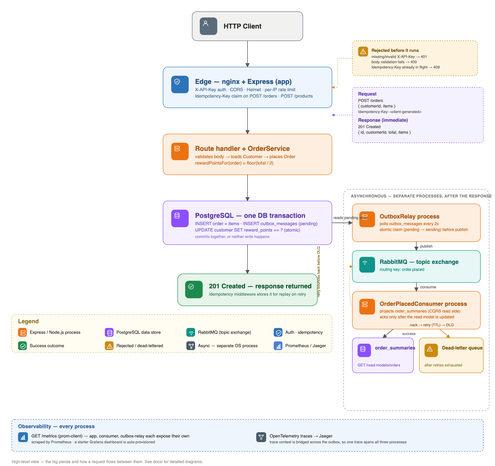
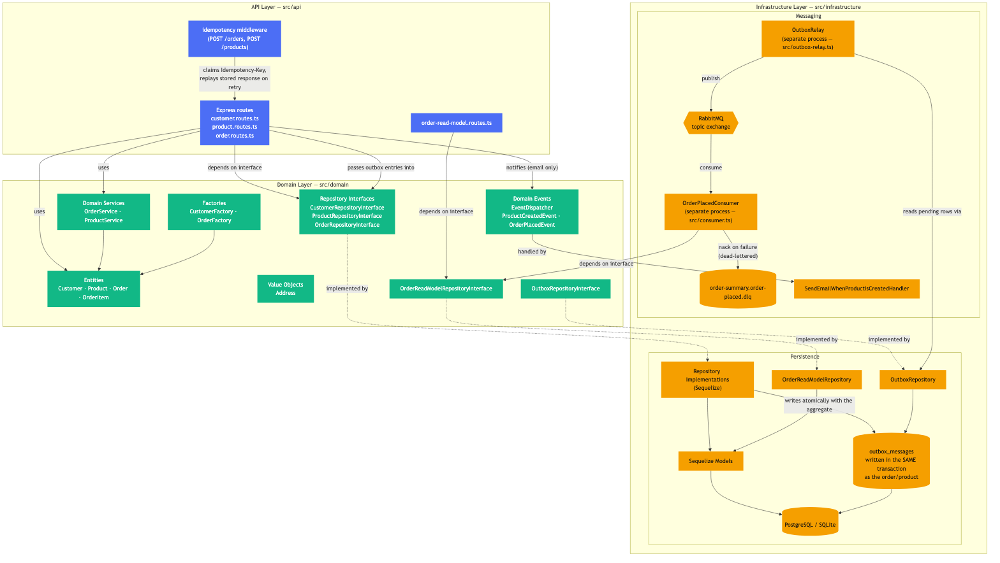
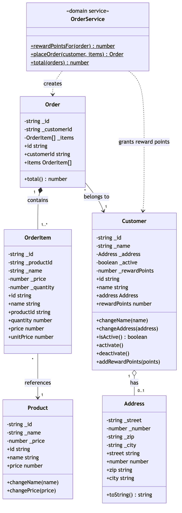
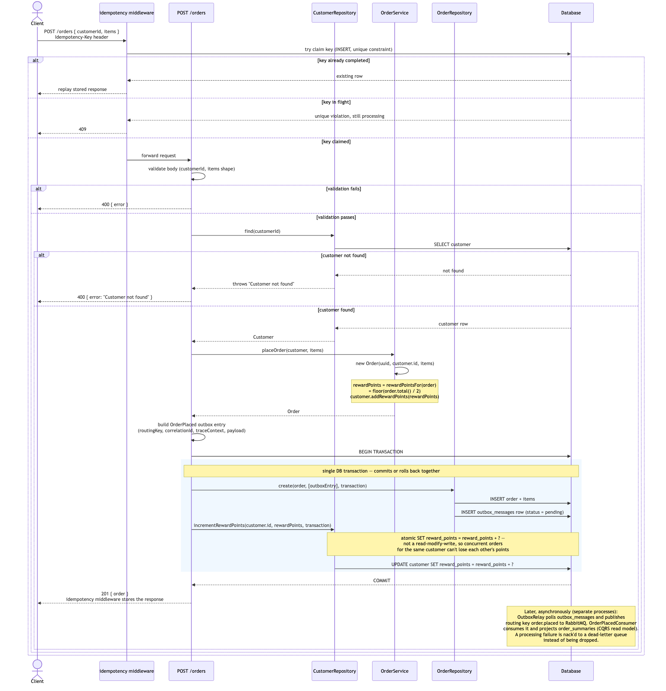
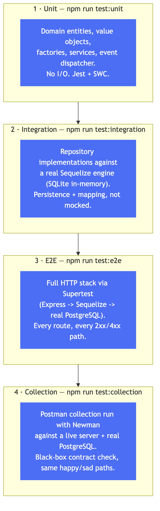
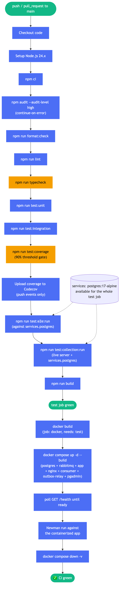
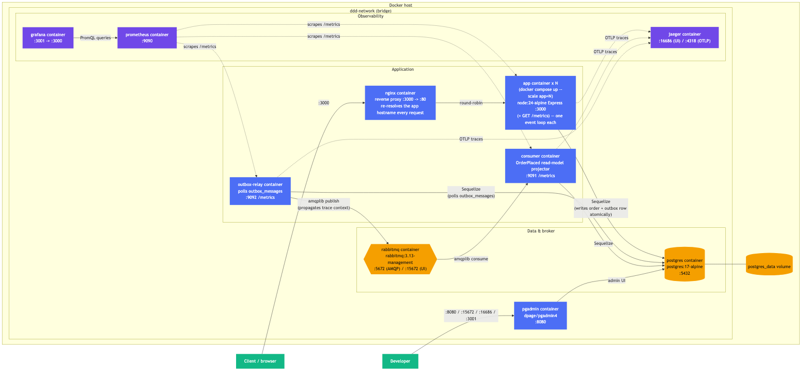

# Documentation

Diagrams for this project. Most sources live in [`mmd/`](mmd/) as [Mermaid](https://mermaid.js.org/) `.mmd` files; the system overview below is hand-authored SVG (source in [`src/`](src/)) since it needed callout annotations and custom icons Mermaid can't produce. Rendered PNGs for all of them live in [`img/`](img/).

To re-render after editing a `.mmd` file:

```bash
npx @mermaid-js/mermaid-cli -i docs/mmd/<name>.mmd -o docs/img/<name>.png -b white -s 2
```

To re-render the overview after editing [`src/system-overview.html`](src/system-overview.html), screenshot it with any headless Chromium/Chrome build at the same size as the page's own `<svg>` (currently 1700×1600) — e.g. with `chrome-headless-shell` (installable via `npx @puppeteer/browsers install chrome-headless-shell`):

```bash
chrome-headless-shell --headless --disable-gpu --hide-scrollbars --window-size=1700,1600 \
  --screenshot=docs/img/system-overview.png "file://$(pwd)/docs/src/system-overview.html"
```

## System overview



The synchronous write path (top) and the asynchronous messaging pipeline (right) are deliberately decoupled: `nginx` and `app` validate the request, write the order and its outbox row in one Postgres transaction, and return a response — none of that waits on RabbitMQ, the relay, or the consumer. Everything from the outbox table onward — `OutboxRelay`, RabbitMQ, `OrderPlacedConsumer`, the read model, the dead-letter queue — runs in separate processes, unable to turn a slow or failed downstream step into a failed request.

## Architecture



Layered architecture: the API layer depends on domain interfaces, never on infrastructure directly. Infrastructure implements those interfaces (dependency inversion) so the domain stays persistence-agnostic. `OrderRepository`/`ProductRepository` write an outbox row in the same transaction as the aggregate (`OutboxRepositoryInterface`); the separate `OutboxRelay` process polls it and publishes to a RabbitMQ topic exchange, so an event is never lost to a broker outage the way a direct publish would lose it. The separate `OrderPlacedConsumer` process consumes `order.placed`, projects it into the `order_summaries` read model behind `OrderReadModelRepositoryInterface` (the CQRS read side, exposed via `GET /read-models/orders`), and dead-letters anything it can't process instead of dropping it.

## Domain model



Core entities, the `Address` value object, and `OrderService` — the domain service that creates an `Order` and grants the customer reward points in one place.

## Order creation sequence



`POST /orders` end to end: body validation, the customer lookup that guards against a non-existent `customerId`, `OrderService.placeOrder` (order creation + reward points), and `OrderRepository.create()` writing the order and its outbox row in one DB transaction — so the two either commit together or neither does. The customer update follows, then the response. Publishing to RabbitMQ and projecting the read model happen later, in the separate `OutboxRelay` and `OrderPlacedConsumer` processes — asynchronous, and never able to turn this request into a 5xx.

## Testing strategy



Four independent layers, each catching different classes of bugs:

| Layer | Command | What it exercises |
|---|---|---|
| Unit | `npm run test:unit` | Domain logic in isolation — entities, value objects, factories, services, event dispatcher. No I/O. |
| Integration | `npm run test:integration` | Repository implementations against a real Sequelize engine (SQLite in-memory) — persistence and mapping, not mocked. |
| E2E | `npm run test:e2e` | The full HTTP stack (Express → Sequelize → real PostgreSQL) via Supertest, every route, every happy and sad path. |
| Collection | `npm run test:collection` | The Postman collection run with Newman against a live server and real PostgreSQL — a black-box contract check independent of the Jest test code. |

## CI pipeline



GitHub Actions runs every layer above on a real PostgreSQL service container, then a second job builds the Docker image and validates it end to end — see [`.github/workflows/ci.yml`](../.github/workflows/ci.yml).

## Deployment



`docker compose up` runs eleven services on one bridge network: the API server (`app`, horizontally scalable — `docker compose up --scale app=N` — with no fixed container name or published port so N can actually run side by side), `nginx` fronting the `app` pool (re-resolves the `app` hostname on every request so it round-robins across however many replicas are currently up), the OrderPlaced read-model projector (`consumer`) and the outbox relay (`outbox-relay`) — same image as `app`, different entrypoints, and both independently scalable the same way (`--scale consumer=N`, `--scale outbox-relay=N`) — PostgreSQL (tuned for the checkpoint-stall failure mode described in [Load testing](#load-testing) below, and bootstrapped via versioned migrations under a Postgres advisory lock rather than `sequelize.sync()`) and RabbitMQ, `jaeger-volume-init` (a one-shot ownership fix for Jaeger's trace-storage volume) plus Jaeger/Prometheus/Grafana for observability, and an optional PgAdmin UI. See [`docker-compose.yml`](../docker-compose.yml) and [`Dockerfile`](../Dockerfile).

Scaling `outbox-relay` past one replica needs coordination so two replicas don't fetch and publish the same pending row. `OutboxRepository.claim()` is an atomic `UPDATE ... WHERE status='pending'` that only one replica's query can win; a replica that loses the race treats the row as someone else's rather than an error. `consumer` replicas need no equivalent coordination — RabbitMQ's standard "competing consumers" pattern already hands each message to exactly one of them.

All three application processes export OpenTelemetry traces to Jaeger over OTLP and serve their own `GET /metrics` for Prometheus to scrape (`app` on its main port, `consumer`/`outbox-relay` on dedicated metrics ports) — a starter Grafana dashboard is auto-provisioned against Prometheus. Because publishing happens later, in a different process, than the HTTP request that wrote the outbox row, the trace context is captured at write time and re-injected right before `OutboxRelay` publishes (`infrastructure/observability/trace-context.ts`) — that's what makes one trace span `app` → `outbox-relay` → `consumer` instead of stopping at the outbox table.

## Load testing

`scripts/load-test/order-flow.js` (`npm run test:load`, needs the [k6](https://k6.io/docs/get-started/installation/) binary) simulates concurrent shoppers with a `ramping-vus` scenario (up / hold / down), each virtual user browsing, checking the read model, or placing an order with a few seconds of "think time" between actions rather than hammering the API in a tight loop. Every request the script sends carries an `X-API-Key` header (`API_KEY` env var, defaulting to the same `local-dev-key` used elsewhere).

Three things in the stack exist specifically to handle this kind of load:

- **Outbox relay backlog draining** — `OutboxRelay.pollOnce()` drains the whole pending backlog in batches within one poll interval, instead of one fixed-size batch per interval, with a "no progress in this batch → back off to the next poll" guard so a persistently failing publish can't spin hot.
- **Horizontal `app` scaling** — a single Node process is one event loop, so `app` scales via `docker compose up --scale app=N` behind the `nginx` reverse proxy rather than Node's in-process `cluster` module — the pattern that matches "add more replicas as demand grows," and what actually raises throughput under concurrent load, not database tuning.
- **Postgres write tuning** — the `postgres` service runs with `synchronous_commit=off` (commits don't wait on an fsync to disk — an acceptable trade for local/dev; revisit on real block storage) plus larger `shared_buffers`/`max_wal_size`, avoiding long checkpoint I/O stalls under sustained write load.

**Rate limiting in a single-host test run.** `express-rate-limit` buckets by `req.ip`, and every k6 virtual user in a local run shares one IP — a high VU count can blow through the default `RATE_LIMIT_MAX` (300/min) and get `429`s instead of exercising the endpoint under load. For a meaningful single-host load test, set `RATE_LIMIT_MAX` much higher (or bypass the limiter for the load-test host) for the duration of the run — a test-environment setting, not something to change in the deployed default.
